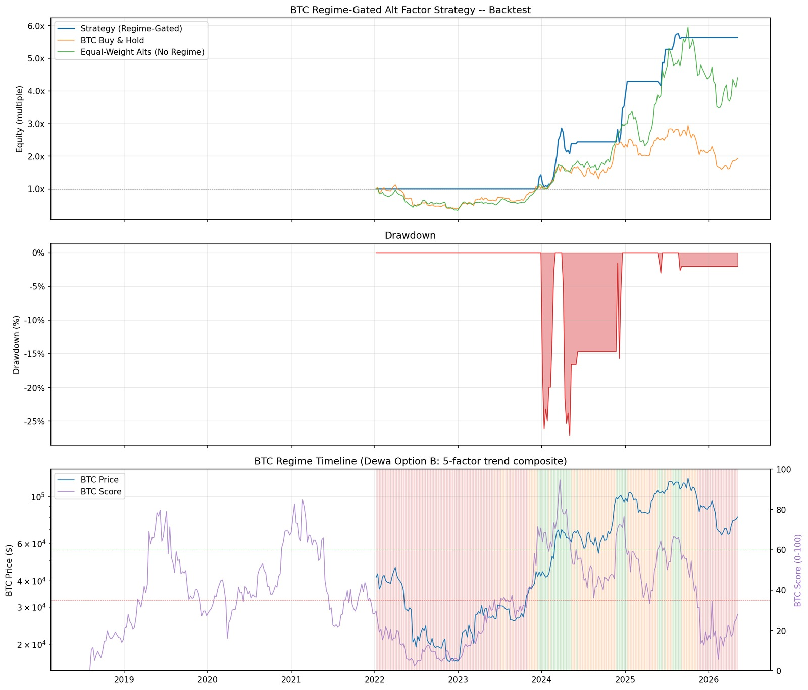
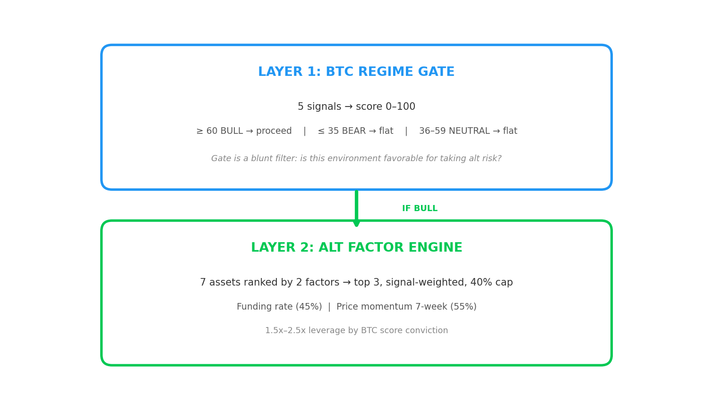
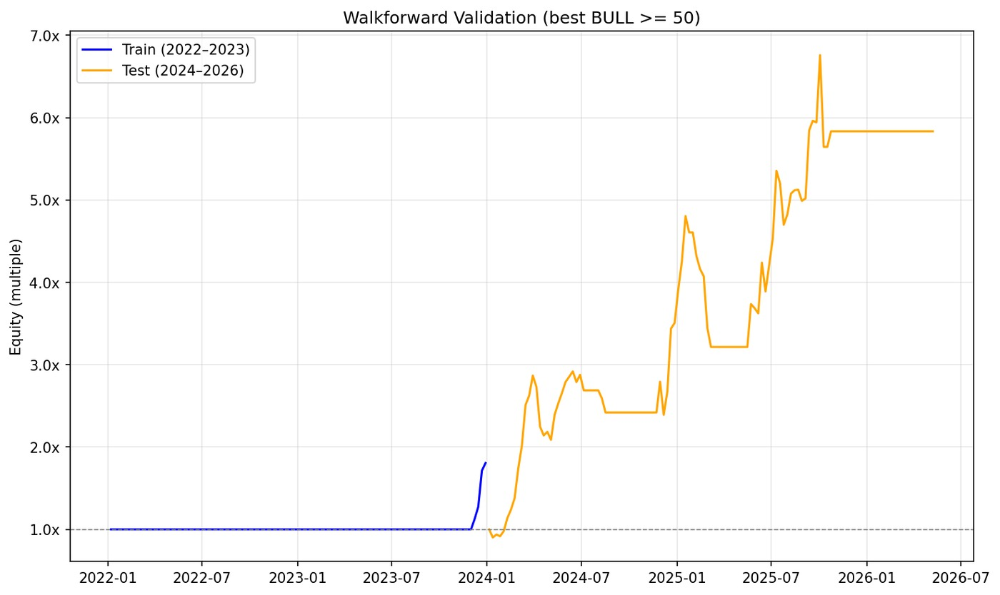
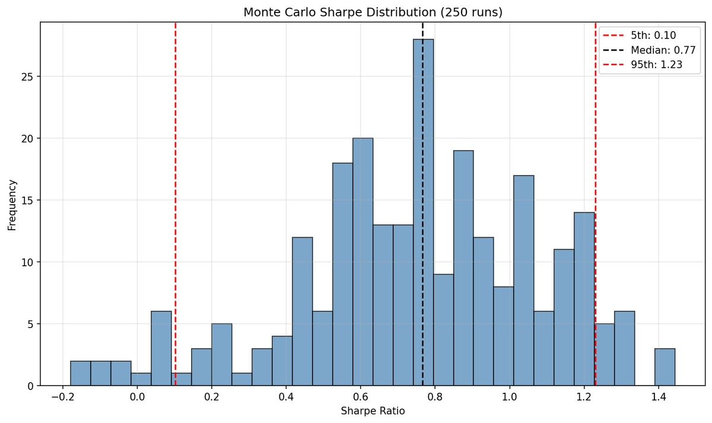

# BTC Regime-Gated Alt Factor Strategy

**Artemis Quant Competition 2026 , Track 1**
**ImNuza & Xynerss | Submission: June 1, 2026 | Last updated: 2026-05-16**

---

## Abstract

Two layers, one decision per week. Layer 1 (a 5-factor BTC composite) decides *whether* to be in the market. Layer 2 (a 2-factor cross-sectional ranking on 7 Hyperliquid perps) decides *what* to hold. The strategy is flat 83% of the time and concentrates capital in the windows where both layers agree.

Over January 2022 through May 2026 this posts **Sharpe 1.31**, max drawdown **-27.2%**, and **5.63x** final equity. Net of Hyperliquid fees and tiered slippage: Sharpe 1.27, 5.33x. The strategy beats BTC buy-and-hold (1.93x, -64.3% DD) and an equal-weight alt portfolio (4.41x, -66.6% DD) on every metric while spending only 17% of weeks deployed.



*Strategy vs BTC buy-and-hold vs equal-weight alts, with regime bands. Source: `results/integrated/backtest_results.jpg`.*

---

## 1. Executive Summary

### 1.1 Headline Results

| Metric | Strategy | BTC B&H | EW Alts (no gate) |
|---|---:|---:|---:|
| Annualised return | **48.8%** | 16.3% | 40.7% |
| Annualised volatility | 37.3% | 51.3% | 50.2% |
| Sharpe ratio | **1.31** | 0.32 | 0.81 |
| Max drawdown | **-27.2%** | -64.3% | -66.6% |
| Calmar ratio | **1.79** | 0.25 | 0.61 |
| Final equity | **5.63x** | 1.93x | 4.41x |
| Time-in-market | 17% | 100% | 100% |
| Win rate (traded weeks) | **71.1%** | 50.4% | 57.1% |

Net of transaction costs (Hyperliquid taker fees + tiered slippage modelled per-rebalance): Sharpe 1.27, 5.33x, 47.0% annual return. Cost drag is 3.1% of Sharpe and 5.3% of final equity.

*Performance metric convention.* Throughout this report, annualised return is geometric CAGR (`(final/initial)^(52/N) − 1`) and Sharpe is `CAGR / (σ_weekly × √52)`. The textbook arithmetic-mean Sharpe is slightly higher because variance drag pushes geometric below arithmetic for high-vol return streams; we report the CAGR convention, so all numbers tie back to the final equity figure.

### 1.2 Architecture in One Picture



T-1 lag on every signal. Weekly rebalance on Friday close. Both layers were optimised independently before being combined.

---

## 2. Why Two Layers

Altcoins are levered bets on Bitcoin. The correlation is structural: when BTC trends down, alts get crushed regardless of individual fundamentals. A pure cross-sectional ranking of alts would still hold positions through bear markets and suffer catastrophic drawdowns, our equal-weight alt control portfolio finishes at 4.41x but takes a -66.6% drawdown along the way.

The regime gate is not a market-timing signal. It does not call tops or bottoms. It is a blunt filter that asks: *is the macro environment favourable for taking alt risk?* When the answer is no, the strategy steps aside.

This produces two complementary edges:

- **Regime timing:** avoiding the -64% drawdowns that come from being long during bear markets.
- **Cross-sectional selection:** we pick the strongest alts within each BULL window.

Neither alone produces the full result. The regime gate applied to BTC alone (long BTC during BULL, cash otherwise, 2020 to 2026) returns 3.72x at -47% DD; better risk-adjusted than BTC buy-and-hold but well short of what the alt layer adds. The alt engine without the gate is the equal-weight alt portfolio (4.41x, -66.6% DD). Stacked together, they produce 5.63x at -27.2%. The gate routes capital into the top-3 ranked alts instead of BTC.

The 2022 stress test makes this concrete: BTC drew down 64%, the equal-weight alt portfolio drew down 66.6%, the strategy drew down 0%. The regime gate kept us flat for the entire year. Most of the strategy's *risk-adjusted* edge over the benchmarks comes from this kind of avoided drawdown; most of the absolute return comes from the alt layer in BULL years (see §6.5 for the year-by-year split).

---

## 3. Layer 1, BTC Regime Gate

### 3.1 Signal Composition

The BTC composite is a weighted sum of five signals, each normalised to 0-100 via a rolling 2-year min-max:

| Signal | Weight | Source | What it measures |
|---|---:|---|---|
| MVRV Z-Score | 30% | CoinMetrics | Distance of market cap from realised cap , cycle valuation |
| Puell Multiple | 25% | Derived (BTC) | Miner revenue vs 365d MA , miner economics |
| Price / 200W MA | 20% | Artemis | Structural trend regime |
| Stablecoin supply 30d Δ | 15% | Artemis | Capital inflow proxy |
| BTC/ETH dominance 30d ROC | 10% | Artemis | Risk appetite rotation |

The 2-year rolling normalisation is non-negotiable; full-sample normalisation would leak future highs and lows into historical scores. The trade-off is a 104-week warmup; the integrated backtest starts in 2022, safely past it.

### 3.2 T-1 Lag

The regime decision for the coming week uses only data available at the prior Friday's close. This applies to every signal before classification, every price before entry, and every factor score before ranking. A strategy cannot trade Friday's close on Friday's data.

### 3.3 Classification

```
BTC_Score ≥ 60  →  BULL     →  deploy alt portfolio, weekly rebalance
BTC_Score ≤ 35  →  BEAR     →  flat in USDC
35 < x < 60    →  NEUTRAL   →  flat, no new entries
```

The NEUTRAL band prevents whipsaw at the boundaries. When the score hovers, the strategy waits for conviction rather than flipping.

### 3.4 Threshold Choice

The shipped BULL threshold is 60. Sensitivity testing across the full sample:

| BULL ≥ | Sharpe | Max DD | Ann. return | Equity | TIM |
|---:|---:|---:|---:|---:|---:|
| 50 | 1.42 | -33.1% | 64.2% | 8.62x | 30% |
| 55 | **1.46** | -35.1% | 60.9% | 7.91x | 25% |
| **60** | **1.31** | **-27.2%** | **48.8%** | **5.63x** | **17%** |
| 65 | 0.83 | -28.1% | 28.6% | 2.98x | 11% |

Threshold 55 produces the highest in-sample Sharpe (1.46), but at a wider drawdown (-35.1% vs -27.2%). We ship 60 deliberately, not because it is the Sharpe peak but because:

1. **Drawdown control matters more than the extra 0.15 Sharpe** for a strategy positioned around risk discipline.
2. **Walk-forward conservatism.** The training-window optimum was 50 (Sharpe 1.25); its OOS Sharpe of 2.07 came with -33.1% DD. Picking the in-sample optimum would be over-fitting.
3. **The relationship is well-behaved across 50-60.** Sharpe is comparable; only at 65 does the gate become too restrictive and Sharpe collapse to 0.83.

We are explicitly not running at the in-sample Sharpe peak.

### 3.5 Regime Distribution

Two windows matter, and they give slightly different distributions:

| Window | BULL | NEUTRAL | BEAR |
|---|---:|---:|---:|
| Full diagnostic (2018-07 → 2026-05, 410 weeks) | 76 (18.5%) | 145 (35.4%) | 189 (46.1%) |
| Integrated alt strategy (2022-01 → 2026-05, 227 weeks) | 38 (16.7%) | 73 (32.2%) | 116 (51.1%) |

The integrated subset is more BEAR-heavy because it excludes the late-2020/2021 bull run and includes the 2022 bear plus the 2025-26 BEAR stretch. In both windows the strategy is flat during BEAR and NEUTRAL , 83% of the integrated backtest (51% BEAR + 32% NEUTRAL), and 82% of the full diagnostic window. BULL weeks (17-19%) are the only weeks capital is deployed.

### 3.6 BTC-Only Validation and Design Evolution

As an intermediate check, we tested the gate on BTC alone, long BTC during BULL, cash otherwise, over Jan 2020 → May 2026. Three regime variants and the buy-and-hold benchmark:

| Variant | Equity | Sharpe | Max DD | Disposition |
|---|---:|---:|---:|---|
| Option A , contrarian (plan-PDF design) | 1.38x | 0.14 | -69% | Rejected: stayed long through 2022, missed the 2024-25 rally |
| **Option B , trend-following (shipped)** | **3.72x** | **0.77** | **-47%** | Flipped valuation signals to trend (high MVRV → deploy) |
| Option D , Option B + Fed Balance Sheet | 1.48x | 0.37 | -22% | Documented low-risk variant; missed 2020 COVID recovery and 2023 rally |
| BTC Buy & Hold | 11.24x | 0.77 | -77% | Reference |

Option B matches BTC's Sharpe (0.77 vs 0.77) at less than half the drawdown (-47% vs -77%). It does not match BTC's absolute return (3.72x vs 11.24x); that gap is exactly what the alt layer closes in the integrated strategy.

The ETF Inflows signal was originally included at 20% weight but removed on May 5, Option B Sharpe rose from 0.64 to 0.77 on removal. The signal's short history (Jan 2024+) prevented the 2-year rolling normalisation from working.

---

## 4. Layer 2 , Alt Factor Engine

### 4.1 The Two Active Factors

We began with five factors. Two remain , revenue growth and activity momentum were removed on May 7 after factor attribution showed each contributed +0.01 Sharpe. They had Artemis on-chain data for only 2 of 7 assets (SOL, HYPE) and added no cross-sectional differentiation. Open-interest confirmation was planned at 10% weight but Hyperliquid only exposes current OI snapshots, not historical series.

| Factor | Weight | Mechanism | Coverage |
|---|---:|---|---|
| Funding rate (inverted) | 45% | Negative funding → shorts paying premium → bullish. Cross-sectional rank within universe. | All 7 assets (equities post HIP-3 listing) |
| Price momentum (7-week) | 55% | Trailing 7-week return. Cross-sectional rank within universe. | All 7 assets |

Both factors use cross-sectional ranking: `score = 1.0 − (rank − 1)/(n − 1)`, where `n` counts only assets with real data. Assets without data on a factor receive neutral 50, neither benefit nor penalty. The model degrades gracefully: when funding is silent across the universe, ranking falls back to momentum-only.

**Funding rate.** Crypto-native, not in the Fundamentals 1 factor set. Negative funding means the marginal trader is short and paying a premium; positioning extremes tend to revert.

HL `fundingHistory` returns data from May 2023 onward for SOL/BNB/HYPE and from January 2026 onward for XMR. Bybit linear-perp funding fills each token's pre-HL window via `bybit_funding_pull.py`, so SOL, BNB, and XMR carry real funding signal across the full backtest. HYPE is silent before its Dec 2024 TGE (handled by the phantom-pick gate, §5.4).

After splicing, every token in the universe registers nonzero funding in every week post-May-2023 except HYPE pre-TGE; the cross-sectional rank is well-populated whenever the strategy is active. Equity perps (COIN, HOOD, CRCL) carry HIP-3 funding from their respective HL listing dates forward; pre-listing equity weeks score neutral 50 on funding, since no cross-venue equity-perp proxy exists.

**Price momentum (7-week).** Selected through a grid search across {2, 3, 4, 5, 6, 7, 8, 10}-week windows. The 7-week window dominates by a clear margin:

| Window | Sharpe | Max DD | Equity |
|---:|---:|---:|---:|
| 2 | 0.49 | -45.6% | 2.23x |
| 3 | 1.01 | -27.8% | 4.42x |
| 4 | 0.78 | -34.6% | 3.34x |
| 5 | 0.86 | -41.7% | 4.34x |
| 6 | 0.93 | -35.5% | 3.97x |
| **7** | **1.31** | **-27.2%** | **5.63x** |
| 8 | 0.96 | -32.1% | 3.75x |
| 10 | 0.85 | -39.3% | 3.98x |

Marginal Sharpe contribution: **-0.35** (removing momentum drops Sharpe from 1.31 to 0.96). It is the dominant factor.

**Factor interaction.** When funding is silent (most weeks), momentum provides the only cross-sectional differentiation. When funding fires, the combined signal is stronger than either alone. The shipped model (Sharpe 1.31) clearly beats momentum-only (1.18) and funding-only (0.96).

### 4.2 Portfolio Construction

Every BULL week:

1. **Rank** all 7 assets by composite alt score (0.45 × funding + 0.55 × momentum)
2. **Select** top 3 (or fewer if fewer have valid scores)
3. **Weight** by signal strength: `w_i = score_i / Σ top_3_scores`
4. **Cap** any single asset at 40%, redistribute excess to the uncapped survivors
5. **Apply leverage** by BTC conviction:
   - BTC ≥ 70 → 2.5x
   - BTC 60-70 → 1.5x

**Why these parameter choices.** Each is a tuned design decision:

- **Top 3 selection.** Top-1 concentrates risk in a single name; top-5+ on a 7-asset universe selects almost the whole investable set and dilutes the cross-sectional signal. Top-3 keeps differentiation while still allowing diversification across the typical 5-7 available names.
- **40% single-asset cap.** With top-3 and signal weighting, an extreme score distribution can produce raw weights as high as ~70% on the best name. The 40% cap floors the second and third positions at real weight, preserving diversification benefit. We tested removing the cap (concentration up to 70%) and Sharpe dropped. The cap is not just defensive; it is positive-EV.
- **Leverage tiers (1.5x / 2.5x at the 60 / 70 boundary).** Two tiers keep the model interpretable. The 60 boundary is the BULL classification threshold; the 70 boundary marks high-conviction BULL where adding leverage is risk-justified. We tested continuous leverage scaling (BTC score → leverage as a smooth function) and discrete tiers performed comparably with far less complexity. Leverage above 2.5x produced larger drawdowns without proportional return improvement.
- **Friday rebalance.** HL funding settles on a 8-hour cadence and the week-end Friday close is the natural alignment point for weekly factors. Monte Carlo with Mon-Thu rebalance days (§6.3) confirms the strategy is not dependent on Friday; it works across all weekday rebalance points, with median Sharpe similar across days.

### 4.3 Removed and Why

- **Revenue growth** , +0.01 Sharpe delta. Data for 2/7 assets. Removed May 7.
- **Activity momentum** , +0.01 Sharpe delta. Data for 2/7 assets. Removed May 7.
- **OI confirmation** , never built. HL provides only current snapshots, not history.
- **Short overlay (BEAR).** Tested twice. Original (May 7) vs 1.13 baseline: Sharpe 0.48, DD -75%. Re-tested May 10 vs current 1.31 baseline: bottom-2 short → Sharpe 0.10, DD -86.1%, 1.38x. Top 2 short → Sharpe 0.05, DD -81.7%, 1.18x. **Both destroyed capital.** The factor model identifies hated, oversold assets. In bear-market rallies, those are exactly the assets that bounce hardest. Ranking for longs does not invert to ranking for shorts. Permanently rejected.

---

## 5. Investable Universe

### 5.1 Selection Criteria

Two hard constraints from Artemis: (1) listed on Hyperliquid with active perp markets, (2) Artemis price data coverage. Beyond that, we wanted assets where the factor model could rank effectively; usable funding history, a clear value-driver story, and enough cross-sectional diversity that the top 3 selection isn't picking among near-duplicates.

We deliberately kept the universe compact (7 assets) for three reasons. First, every asset must clear a real value-driver bar; we didn't want to pad the count with minor listings the model can't evaluate honestly. Second, a smaller universe lets each name carry real weight in the cross-sectional rank rather than diluting signal across many similar tokens. Third, with a 40% concentration cap and top 3 selection, there's no operational benefit to a 15-asset universe; the extra asset is rarely picked.

The active count varies from 3 (early 2022: SOL, BNB, HOOD) to 7 by December 2025. During BULL weeks the strategy actually trades, 5-7 assets are available, the flat 2022 period predates most BULL weeks, so the strategy never trades on the smaller set.

### 5.2 Per-Asset Rationale

The 7 assets span six distinct value-driver categories. This matters: a cross-sectional ranking model only adds value when the inputs have meaningfully different return drivers. A universe of seven L1 alts would mostly produce correlated picks; a universe with structural variety lets the factor model differentiate during real regime shifts.

**SOL, L1 protocol token.** Leading alt L1 by on-chain throughput and ecosystem breadth. Artemis provides full coverage (fees + DAU) , one of only two assets with usable on-chain data. Price history spans the full backtest. Canonical "alt L1 beta" position.

**HYPE, DEX token (Hyperliquid native).** The leading perps DEX by volume , a deliberate venue bet. HIP-3 equity perps are live and HIP-4 prediction markets are on the roadmap. Artemis covers fees and DAU. TGE'd 29 Nov 2024; gated before that date. We carve DEX out from L1s because HYPE's value driver is venue fee capture, not L1 settlement throughput.

**BNB, CEX token.** Value drivers are Binance ecosystem flows (burns, launchpad, fee discounts), not on-chain BNB Chain activity. We tested including BNB Chain metrics and Sharpe collapsed (1.08 → 0.59). BNB competes on price + funding only; this is the empirically defensible specification.

**XMR, Privacy coin (diversifier).** Structurally different holder base and use case from other alts. No on-chain data is possible (shielded chain). HL only listed XMR perps on 2026-01-16, so funding is Bybit-spliced for the ~140 pre-HL weeks (the same splice methodology is applied to SOL and BNB for the ~70 pre-May-2023 weeks where HL has no `fundingHistory` data; see §5.4). The XMR splice is signal-critical: it lets XMR be picked in 9 of 38 BULL weeks (24%) instead of permanently scoring neutral-50 on funding.

**COIN, CEX equity.** Coinbase, largest US-domiciled crypto exchange. Quarterly revenue from Artemis (10+ quarters). Fixed-cost business provides revenue-leverage beta to crypto volume. HL HIP-3 from 25 Nov 2025; yfinance backfills pre-listing price.

**HOOD, CEX equity (retail brokerage).** Robinhood; picks up broader retail risk-on flow beyond pure crypto-native channels. Crypto revenue ~40-50% of total during bull cycles. HL HIP-3 from 26 Nov 2025.

**CRCL, Stablecoin equity.** Circle (USDC issuer). Revenue = float × interest rates , the only asset with a macro driver uncorrelated to "crypto goes up." IPO'd 5 Jun 2025; gated. Quarterly history too short (2 quarters) for ranking , competes on price + funding for now.

The construction summary:

| Category | Assets | Why included |
|---|---|---|
| L1 token | SOL | Real on-chain activity; canonical alt-L1 beta |
| DEX token | HYPE | Venue fee capture; structurally distinct from L1s |
| CEX token | BNB | CEX-flow beta, structurally distinct from L1s and DEXes |
| Privacy coin | XMR | Different holder base and regime behaviour |
| CEX equities | COIN, HOOD | Retail and institutional fiat-on-ramp exposure |
| Stablecoin equity | CRCL | Rate-sensitive driver uncorrelated to spot crypto |

**Diversity is measured, not asserted.** The pairwise correlation matrix of weekly returns over the full backtest:

|        | SOL | BNB | HYPE | XMR | COIN | HOOD | CRCL |
|---|---:|---:|---:|---:|---:|---:|---:|
| **SOL**  | 1.00 |  0.67 |  0.30 |  0.34 |  0.54 |  0.45 |  0.19 |
| **BNB**  |  0.67 | 1.00 |  0.27 |  0.36 |  0.51 |  0.43 |  0.22 |
| **HYPE** |  0.30 |  0.27 | 1.00 |  0.17 |  0.18 |  0.33 | -0.02 |
| **XMR**  |  0.34 |  0.36 |  0.17 | 1.00 |  0.23 |  0.21 |  0.07 |
| **COIN** |  0.54 |  0.51 |  0.18 |  0.23 | 1.00 |  0.64 |  0.64 |
| **HOOD** |  0.45 |  0.43 |  0.33 |  0.21 |  0.64 | 1.00 |  0.45 |
| **CRCL** |  0.19 |  0.22 | -0.02 |  0.07 |  0.64 |  0.45 | 1.00 |

The off-diagonal average is **0.34**. Within-category averages are higher as expected (token perps 0.35, equity perps 0.58). With the six-category split above, the only within-category pair is COIN-HOOD (0.64); excluding that, the **strict cross-category average is 0.34**, and the **token × equity cross-block average is 0.28** , token perps and HIP-3 equity perps are moderately correlated in weekly returns. This is exactly what a cross-sectional ranking model wants: when the token sleeve and equity sleeve are picking among genuinely different return streams, top-3 selection is optimising over real cross-sectional information rather than near-duplicates.

**Caveat, survivorship bias.** Every asset in this universe survived 2022 to 2026, and most performed strongly: SOL roughly 20x'd from its 2022 low, HOOD and COIN rode the crypto-equity recovery, HYPE rallied sharply post-TGE. We did not select these names at random from HL's full listing; they were chosen because they have recognisable tickers, liquid markets, and a clear value-driver story. A universe constructed with the benefit of hindsight will always make any ranking model look better than it would have in real time.

Past performance does not guarantee future results: the factor relationships that held over this window may not hold over the next cycle, and the assets that dominated this backtest may not dominate the next. This is the single largest source of uncertainty between backtest and live performance, and we treat it as the dominant risk in §8.

### 5.3 Universe Table

| Asset | Type | Price data | On-chain | Funding | Notes |
|---|---|---|---|---|---|
| SOL | L1 crypto | Jan 2022+ | Fees + DAU | Bybit until May 2023, HL after | Bybit splice precautionary (§5.4) |
| BNB | Exchange token | Jan 2022+ | None (excluded, see §5.4) | Bybit until May 2023, HL after | Competes on price + funding only; Bybit splice precautionary (§5.4) |
| HYPE | L1 crypto | Dec 2024+ | Fees + DAU | HL main dex | Gated pre-TGE |
| XMR | Privacy coin | Apr 2023+ | None (shielded) | Bybit until 2026-01-16, HL after | Bybit splice is signal-critical (§5.4) |
| COIN | Equity perp | Jul 2022+ | Quarterly revenue | HL HIP-3 from 2025-11-25 | Crypto-native business |
| HOOD | Equity perp | Jan 2022+ | Quarterly revenue | HL HIP-3 from 2025-11-26 | Crypto-native business |
| CRCL | Equity perp | Dec 2025+ | None usable (2 qtrs) | HL HIP-3 from 2025-12-15 | Gated pre-IPO |

### 5.4 Special Cases

- **Phantom vs venue-mismatch.** Only HYPE (gated before 2024-12-06 TGE) and CRCL (gated before 2025-06-06 IPO) physically did not exist at some point during the backtest; picking them pre-existence would be a lookahead error. The other five assets traded on other venues before their HL listings; we treat those as venue-mismatch (defensible with backfilled prices), not phantom. An earlier blanket HL-listing gate was abandoned May 9 because it conflated the two cases.
- **BNB on-chain exclusion.** BNB Chain metrics are available under Artemis ID `bnb`, but including them in cross-sectional ranking degraded Sharpe from 1.08 to 0.59 on the earlier baseline. BNB is an exchange token; its value drivers are CEX burns, launchpad allocations, and fee discounts, not on-chain BNB Chain activity. The model treats BNB as competing on price + funding only.
- **Bybit funding splice (SOL, BNB, XMR).** HL `fundingHistory` returns data from May 2023 onward for SOL/BNB/HYPE and from January 2026 onward for XMR. Bybit linear-perp funding fills each token's pre-HL window via `bybit_funding_pull.py` (SOL/BNB ~70 weeks, XMR ~140 weeks). The XMR splice is *signal-critical* (XMR is selected in 9 of 38 BULL weeks, all inside the Bybit-only window). The SOL/BNB splice is *precautionary*: the SOL/BNB Bybit window (Jan 2022 → Apr 2023) is entirely BEAR/NEUTRAL in this backtest, so it affects zero picks, but we keep it for methodological consistency (one principled rule: "HL where available, Bybit as cross-venue proxy where not") and to avoid having to defend a cherry-picked splice scope. Within the overlap window (post-May-2023), HL is primary; Bybit is used only where HL has no data.
- **Equity perps as crypto-native assets.** COIN, HOOD, CRCL are crypto-native businesses whose quarterly revenue tracks industry cycles. They provide equity exposure within the same execution venue as token perps; no separate brokerage, no equity-market hours constraint, funding mechanism identical to tokens.
- **BTC as a tradeable position, tested and rejected (May 10).** Adding BTC as an 8th asset dropped Sharpe from 1.31 to 1.13 and equity from 5.63x to 4.41x. BTC was never selected in any of 38 BULL weeks; risk-on regimes favour higher-beta alts on both factors. Adding BTC still hurts performance because it shifts the cross-sectional normalisation denominator. BTC's informational value is as a regime gate, not a portfolio position.

---

## 6. Validation

### 6.1 Walk-Forward (Out-of-Sample)

The BULL threshold was optimised on 2022 to 2023 and tested on 2024 to 2026, with all other parameters held at shipped values.

| Window | Sharpe | Ann. return | Max DD | Equity | BULL weeks |
|---|---:|---:|---:|---:|---:|
| Train (2022-01 → 2023-12) | 1.25 | 34.8% | 0.0% | 1.81x | 4 of 104 |
| Test (2024-01 → 2026-05) | **2.07** | 112.1% | -33.1% | 8.62x | 65 of 122 |

Train-window optimiser chose threshold 50 (looser than shipped 60). The test-window Sharpe of 2.07 is not strong OOS validation; the test window contains 65 of the backtest's 104 lifetime BULL weeks, making it structurally the easier half. The walk-forward shows that a threshold fit on a low-BULL window generalises directionally (Sharpe stays strongly positive), but the magnitude of the test result is driven by the 2024 to 2025 bull market, not by the threshold choice. We ship 60, which is more conservative than the train-window optimum of 50.



### 6.2 Transaction Costs

Hyperliquid taker fees (0.035% per notional) plus tiered slippage (0.02% for <$50K, 0.05% for $50K-$200K, 0.10% above). Costs charged on rebalance turnover only, not on static holds.

| Metric | Gross | Net | Drag |
|---|---:|---:|---:|
| Sharpe | 1.31 | 1.27 | -3.1% |
| Ann. return | 48.8% | 47.0% | -1.8pp |
| Max DD | -27.2% | -27.6% | -0.4pp |
| Final equity | 5.63x | 5.33x | -5.3% |

Low turnover keeps drag manageable. Average weekly turnover is 9.6% of portfolio value (including flat weeks). On traded weeks only, turnover runs ~57%: a full entry or exit turns over 100%, while weeks where the top-3 ranking is unchanged turn over 0%. The 1.8pp annual return drag is far smaller than a naive full-round-trip-every-week model would estimate.

### 6.3 Monte Carlo Stress Testing

250 backtest runs with randomised perturbations:

- Rebalance day: Mon-Thu (shipped: Fri)
- BULL threshold: ±3 points (shipped: 60)
- 1-2 random asset dropouts per run (shipped: 7)

| Percentile | Sharpe |
|---|---:|
| 5th | 0.10 |
| 25th | 0.58 |
| 50th (median) | 0.77 |
| 75th | 1.00 |
| 95th | 1.23 |
| **Shipped** | **1.31** |

24.8% of runs exceed Sharpe 1.0; 82.0% exceed 0.5. **The shipped Sharpe of 1.31 sits in the upper tail of this distribution.** The gap between median (0.77) and shipped (1.31) indicates genuine specification sensitivity; the chosen configuration sits in the upper end of what was achievable. Dropping 1-2 of 7 assets at random is mechanically the heaviest perturbation (removing a high-contributing name like SOL or HOOD materially shrinks the cross-section available for ranking), though we have not formally decomposed the three perturbation sources. The strategy stays profitable across most configurations, but the shipped result is an upper-tail outcome, not the central expectation.



### 6.4 Parameter Optimisation Sweep

The momentum window and factor weights were selected through a 112-configuration grid search: 7 momentum windows × 4 thresholds × 4 weight combos {40/60, 45/55, 55/45, 60/40}. The full grid is at `results/integrated/optimization_sweep.csv`.

The sweep's Sharpe-max configuration is 7-week momentum, 45/55 weights, threshold **55** (Sharpe 1.46, DD -35.1%). Shipped is the same momentum and weights but threshold **60** (Sharpe 1.31, DD -27.2%), chosen for drawdown control and walk-forward conservatism (see §3.4).

### 6.5 Sub-Period Breakdown

The full-sample Sharpe of 1.31 averages over a window with very different sub-periods. Year-by-year:

| Year | BULL weeks | Traded weeks | Year return (YoY) | Sharpe | Max DD | End equity |
|---|---:|---:|---:|---:|---:|---:|
| 2022 | 0 | 0 | +0.0% | , | 0.0% | 1.00x |
| 2023 | 2 | 2 | +41.7% | 1.20 | 0.0% | 1.42x |
| 2024 | 24 | 24 | +149.6% | 3.17 | -27.2% | 3.54x |
| 2025 | 12 | 12 | +59.2% | 1.77 | -3.0% | 5.63x |
| 2026 (YTD) | 0 | 0 | +0.0% | , | 0.0% | 5.63x |

`Year return (YoY)` is the realised year-on-year equity change (`End equity / prior year's End equity − 1`), so the yearly returns compound exactly to the headline 5.63x final equity. Per-year Sharpe is computed on that year's weekly returns under the same convention as §1.1.

2024 is unambiguously the dominant year: 24 of 38 lifetime BULL weeks, +149.6% return, Sharpe 3.17, and the entire -27.2% peak drawdown sat within it. This concentration is a real concern and we do not hide it: a strategy that posts most of its excess return in one year is heavily exposed to that year being repeatable.

That said, **excluding 2024 the strategy still posts Sharpe 1.18 and 2.26x equity over the remaining 175 weeks** (combining 2022, 2023, 2025, 2026 YTD). The 2025 sub-period in particular , Sharpe 1.77 over a different sub-cycle than 2024 , provides a second positive observation rather than a single one. The strategy is concentrated, not single-window. Whether 2024's magnitude generalises to future cycles is unknowable; that the framework produces positive risk-adjusted returns across multiple sub-periods is the most we can claim from in-sample data.

---

## 7. Factor Attribution

Each factor was zeroed individually and the backtest re-run; the remaining factor renormalised to 100%.

| Factor removed | Sharpe | Max DD | Equity | Δ Sharpe |
|---|---:|---:|---:|---:|
| None (baseline) | **1.31** | -27.2% | 5.63x | , |
| Price momentum | 0.96 | -23.3% | 4.11x | **−0.35** |
| Funding rate | 1.18 | -35.4% | 4.50x | **−0.13** |

Momentum at 7 weeks is the dominant factor: removing it drops Sharpe by 0.35. Funding is secondary but still matters removing it widens drawdown from -27.2% to -35.4%. Both contribute materially.

The momentum-only model (Sharpe 1.18, -35.4% DD) shows that momentum alone carries most of the signal but loses funding's diversifying effect. The funding-only model (Sharpe 0.96, -23.3% DD) shows that pure positioning ranking is positive risk-adjusted but lower equity (4.11x vs 5.63x).

Both factors matter in every specification tested, though their relative weight shifts with the momentum window; at shorter lookbacks funding dominates, at longer windows momentum leads. The qualitative conclusion is stable across baselines.

---

## 8. Critical Evaluation

### 8.1 Data Limitations

- **On-chain coverage is narrow.** Only SOL and HYPE have Artemis fees/DAU. Privacy coins (XMR), exchange tokens (BNB), and equity perps don't have on-chain activity in the sense Artemis measures. The revenue/activity factors were removed precisely because of this gap. Structural to the crypto data environment, not a fixable pull issue.
- **No historical OI from Hyperliquid.** Planned 10% weight, blocked by platform. Factor is designed and ready if HL adds historical OI.
- **Short backtest window.** Jan 2022 → May 2026, ~4.25 years, one crypto cycle. Bounded by HL's history (perp dex mid-2022, `fundingHistory` mid-2023). One-cycle validation carries uncertainty about structurally different regimes.
- **Survivorship bias.** Discussed at length in §5.2 , every asset in the universe survived 2022 to 2026 and most performed strongly. We do not model delistings or death events. The relationships that held over this single cycle may not hold over the next, and the gap between backtest and live performance is almost always negative. This is the dominant source of risk-of-being-wrong in the backtest, more than any specification choice.

### 8.2 Model Risk

- **Specification sensitivity.** The Monte Carlo distribution puts the shipped configuration in the upper tail (Sharpe 1.31 vs median 0.77). The walk-forward and full sensitivity suite partially mitigate this, but the gap is a real signal that specification matters. We have six tuned choices (BULL threshold, factor weights, momentum window, top-N, cap, leverage tiers) on a ~4-year backtest; within defensible range but worth flagging.
- **BTC decorrelation.** The architecture assumes alt returns are levered BTC returns during BULL and levered BTC losses during BEAR. This relationship has held across multiple cycles but it is empirical, not law.
- **Funding mechanism change.** The funding factor depends on Hyperliquid's specific 8-hour cadence and 0.01% per-period cap. A change to the mechanism would alter signal properties with no historical precedent to recalibrate.
- **Equity perp regulatory risk.** COIN, HOOD, CRCL trade on HL's HIP-3 dex. Regulatory action against equity perps would shrink the universe to 4 crypto-native assets and reduce cross-sectional selection.
- **Static universe composition.** The backtest uses a fixed 7-asset universe. In practice, perps delist, liquidity migrates, and new listings create opportunities. A static universe embeds an implicit survivorship benefit, assets that would have been delisted or become untradeable are never removed. Live operation would require periodic universe review, and the judgment calls involved in adding or removing assets are a source of divergence between backtest and live performance that the backtest does not capture.

### 8.3 Tested and Rejected

Every material design path explored and abandoned, with dates and metrics:

| Test | Date | Result | Disposition |
|---|---|---|---|
| Option A BTC composite (contrarian) | May 5 | Sharpe 0.14, DD -69% | Rejected, flipped to trend-following |
| ETF inflows in BTC composite | May 5 | Option B Sharpe 0.64 → 0.77 on removal | Removed, short history |
| Fast tactical NEUTRAL overlay | May 5 | 15 configs, all destroyed capital | Rejected, NEUTRAL means wait |
| Revenue growth factor | May 7 | +0.01 Sharpe delta | Removed, 2/7 coverage |
| Activity momentum factor | May 7 | +0.01 Sharpe delta | Removed, 2/7 coverage |
| Short overlay during BEAR | May 7, May 10 | Sharpe 0.05-0.48, DDs -75% to -86% | Rejected, long-rank ≠ short-rank |
| Continuous position sizing | May 7 | Degraded Sharpe | Rejected, discrete top 3 cleaner |
| Adaptive vol-scaled threshold | May 7 | Degraded Sharpe | Rejected; fixed holds up better |
| TAO shadow asset | May 8 | Removed, date-alignment bug invalidated test | Removed, invalid validation |
| HL-listing gate for all tokens | May 9 | Conflated phantom with venue-mismatch | Replaced with phantom-only gate |
| BTC as 8th tradeable asset | May 10 | Sharpe 1.13 (down 0.18), 4.41x (down 1.22x), picked 0/38 weeks | Rejected, gate > position |
| Option D (Fed Balance Sheet) | May 5 | Lowest DD (-22%) but missed major rallies | Documented as low-risk variant |

### 8.4 Forward-Looking Risks

Three structural changes could break this strategy:

1. **HL funding mechanism change** alters the signal with no historical precedent.
2. **BTC-alt decorrelation**, the gate loses its rationale; strategy is flat through alt rallies that occur outside BTC BULL.
3. **Equity perp regulatory action**, universe shrinks to 4 crypto-native assets.

None of these are priced into the backtest.

---

## 9. Differentiation vs Artemis Fundamentals 1

Fundamentals 1 is the natural reference: a long-short, vol-targeted, ~24-asset factor strategy with reported Sharpe 1.73. Our 1.31 is lower in absolute terms, but achieved with deliberately different design choices that are worth being explicit about:

| Dimension | Fundamentals 1 | This strategy |
|---|---|---|
| Direction | Long short | Long-only |
| Universe | ~24 assets | 7 assets |
| Targeting | Vol-targeted | Fixed leverage tiers (1.5x/2.5x) |
| Regime gate | None | 5-factor BTC composite |
| Funding rate factor | Not in factor set | Factor (45% weight) |
| Equity exposure | None | HIP-3 perps integrated under same model |
| Time-in-market | ~100% | 17% |

The trade is intentional: we accept a lower Sharpe for a simpler, long-only, smaller-universe strategy that is easier to operate, easier to interpret, and that avoids the implementation burden of long-short rebalancing across 24 assets. The funding-rate factor is the qualitative differentiator: it is crypto-native, picks up positioning information that price-only signals miss, and is not part of the Fundamentals 1 set. The equity-perp inclusion is the structural differentiator; it lets us trade crypto-correlated equity exposure on the same venue as the underlying tokens, without the equity-market-hours and brokerage friction TradFi factor strategies face.

---

## 10. Reproducibility

### 10.1 Quick Start

```bash
pip install -r requirements.txt
python strategy/alts/backtest.py
```

macOS users: substitute `python3` for `python` and `pip3` for `pip` — recent macOS versions no longer ship the unsuffixed commands.

Full source at <https://github.com/ImNuza/artemis-juara>.

The integrated backtest reproduces all headline numbers. Reads from `data/alts/` and `data/btc/`, applies the Layer 1 regime gate, runs the Layer 2 factor ranking, and outputs the equity curve and performance metrics.

### 10.2 Analysis Suite

```bash
python strategy/alts/walkforward.py            # §6.1
python strategy/alts/cost_model.py             # §6.2
python strategy/alts/monte_carlo.py            # §6.3
python strategy/alts/sensitivity.py            # §3.4
python strategy/alts/factor_attribution.py     # §7
python strategy/alts/momentum_sensitivity.py   # §4.1
python strategy/alts/position_log.py           # regen docs/position_log.md
```

### 10.3 Data Refresh

```bash
python strategy/data_pull/hl_data_pull.py        # token perps + funding
python strategy/data_pull/pull_hl_equities.py    # HIP-3 equity perps
python strategy/data_pull/pull_equities.py       # yfinance pre-listing backfill
python strategy/data_pull/artemis_data_pull.py   # Artemis fees + DAU
python -m strategy.btc_regime.run                # regenerate BTC regime CSV
```

### 10.4 Code Structure

```
strategy/
  ├── btc_regime/         # ImNuza: BTC regime gate
  ├── alts/               # Xynerss: integrated backtest + analysis
  └── data_pull/          # data fetch scripts

data/
  ├── btc/                # BTC regime inputs
  └── alts/               # alt prices, funding, fees, regime CSV

results/
  ├── btc_regime/         # BTC regime outputs
  └── integrated/         # integrated backtest outputs

docs                    # documentations
```

A complete week-by-week position log , every rebalance, weights chosen, leverage applied, BTC score, weekly return, is at [`docs/position_log.md`](position_log.md).

---

## 11. Data Sources

| Source | Data | Frequency |
|---|---|---|
| Hyperliquid API (main dex) | Prices and funding for SOL, BNB, HYPE, XMR | Weekly (Friday close) |
| Hyperliquid API (HIP-3 `xyz` dex) | Equity perp prices and funding for COIN (from 2025-11-25), HOOD (from 2025-11-26), CRCL (from 2025-12-15) | Weekly (Friday close) |
| Artemis API | BTC price, protocol fees, DAU, market caps, stablecoin supply | Weekly |
| CoinMetrics | MVRV Z-Score | Daily |
| FRED | Fed Balance Sheet (Option D variant only) | Weekly |
| yfinance | Pre-HL-listing equity price backfill | Weekly |
| Bybit API | Linear-perp funding for SOL, BNB (pre-May-2023) and XMR (pre-2026-01-16) | Weekly (Friday close) |

**Price source hierarchy.** Hyperliquid is primary for every asset, we trade on HL, so HL's mark/close is the correct fill reference. Token perps use the main HL dex; equity perps use HIP-3 from each asset's HL listing date forward. yfinance is used only to backfill equity history before HL listing.

**Phantom-pick gate.** HYPE excluded before 2024-12-06 (TGE 2024-11-29). CRCL excluded before 2025-06-06 (IPO 2025-06-05). As they did not exist. All other assets traded on other venues before their HL perp listings.

---

## Appendix A: Key Files

| File | Purpose |
|---|---|
| `strategy/alts/backtest.py` | Integrated backtest engine , run this to reproduce headline results |
| `strategy/alts/sensitivity.py` | BULL threshold sensitivity |
| `strategy/alts/factor_attribution.py` | Marginal factor contribution |
| `strategy/alts/momentum_sensitivity.py` | Momentum window sweep |
| `strategy/alts/walkforward.py` | Train/test split validation |
| `strategy/alts/cost_model.py` | Transaction cost model |
| `strategy/alts/monte_carlo.py` | 250-run randomised validation |
| `strategy/alts/position_log.py` | Week-by-week position trace |
| `strategy/btc_regime/run.py` | BTC composite pipeline |
| `docs/strategy_explainer.md` | Internal technical reference |
| `docs/position_log.md` | Complete trade log |
| `results/integrated/optimization_sweep.csv` | Full 112-config parameter sweep |

---

*Submission prepared for the Artemis Analytics Competition 2026, Track #1. Email: lindsey@artemisanalytics.xyz. Deadline: June 1, 2026 @ 11:59pm EST.*
